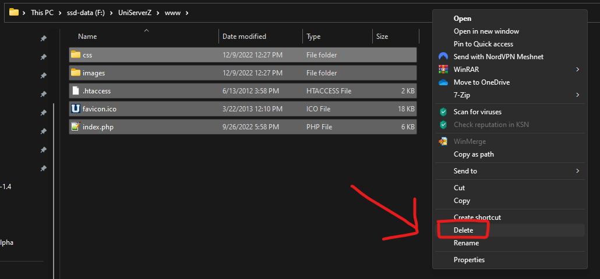

# Uniform Server (recommended)

## 1. Download Uniform Server



Extract the folder somewhere on your drive, lets say, drive **D:**

## 2. Delete content of www folder

Go to **D:\UniServerZ\www** and delete all files inside

## 3. Enable ZIP extension in UniServerZ

### 1. Stop the Apache Server first:

.png>)

### 2. Navigate to PHP -> Edit Basic and Modules ->PHP Modules Enable/Disable

.png>)

### 3. Check ZIP Extension

.png>)

### 4. Start Apache again

.png>)

## 4. Download MyAAC

Download latest version of MyAAC.

Go to MyAAC GitHub page - https://github.com/otsoft/myaac, and navigate to Releases - [https://github.com/otsoft/myaac/releases/latest](https://github.com/otsoft/myaac/releases/latest)

Download the .zipped file from Assets

.png>)

## **5. Move content of the archive**

Unzip downloaded file - **myaac-0.8.21.zip**, and paste the content into **UniServerZ\www**

So at the end it looks like this:

.png>)

## 6. Visit http://localhost

The installation page should be shown like on the picture.

.png>)

If you are using MyAAC 0.9.x, then the install screen will look a bit differently.

## 7. Follow the installation

At the end you should see following screen:

.png>)

